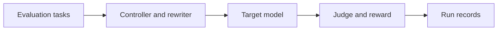

# SAC-Triad

A research implementation for evaluating language-model jailbreak robustness with a reinforcement-learning controller, prompt rewriting, target-model calls, and a judging stage.

**Status:** Research code; missing module  
**Tools:** Python · PyTorch · Typer · Ollama/model router

## What this project does

- Organize target models, the rewriter, judge, and reward calculation as separate components.
- Run experiments with Soft Actor-Critic and compare algorithm, reward, and component ablations.
- Includes implementations of several published attack baselines and run-aggregation utilities.

## How it works

Evaluation tasks → Controller and rewriter → Target model → Judge and reward → Run records

## Repository guide

- [`src/cli.py`](src/cli.py)
- [`src/rl/hybrid_sac.py`](src/rl/hybrid_sac.py)
- [`src/rewriter/rewriter_llm.py`](src/rewriter/rewriter_llm.py)
- [`src/judge/judge_llm.py`](src/judge/judge_llm.py)
- [`src/reward/rewarder.py`](src/reward/rewarder.py)
- [`src/store/run_store.py`](src/store/run_store.py)
- [`config/stack.yaml`](config/stack.yaml)
- [`requirements.txt`](requirements.txt)

## Setup and use

Create a Python virtual environment and inspect `requirements.txt` and `config/stack.yaml`. The main entry point is `src/cli.py`, but it imports `src.data.loader`, which is absent from the inspected tree. Restore that module and the referenced data before attempting the CLI. Configure the local model router/Ollama and any provider credentials separately.

## Current limits

The repository name is spelled SAC-Traid; the research project is SAC-Triad. A complete runnable checkout cannot currently be claimed because the data-loader module is missing. Use the framework only with models and evaluation environments you are authorized to test.

## Results and outputs

Presented as workshop research at AAAI TrustAgent 2026. No new baseline scores were calculated during documentation review.

## Related work

- [Paper PDF](https://openreview.net/pdf?id=hk3qQRuDwA)
- [OpenReview](https://openreview.net/forum?id=hk3qQRuDwA)

## Portfolio

[Project details and related work](https://azka1212.github.io/Azka-AI-Developer/#projects)

> Documentation was checked against the repository source. Unless explicitly stated, setup commands describe the intended entry points and were not executed as part of this documentation update.
